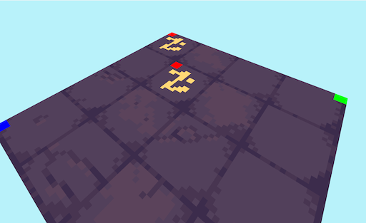

# Mino


Mino is a lightweight, cross-platform game development framework for .NET. It offers a comprehensive suite of commonly used features including audio, rendering, networking, serialization, and resource management.



## Features

- **Cross-Platform**: Build once, run on a wide variety of platforms.
- **Easy to Learn**: All APIs are well-documented and thoroughly commented for a smooth learning curve.
- **MIT Licensed**: Free to use for any purpose, with attribution to the original authors.

## Modules

- **Audio System**
- **2D and 3D Graphics**
- **Networking**
- **Resource Management**
- **Lifecycle Control**

## Quick Start

### I. Clone the project

Begin by cloning the Mino repository to your local machine:
```bash
git clone https://github.com/licphel/Mino.git
cd Mino
```

Open the solution or project file in your preferred IDE. Mino is compatible with:
- **Visual Studio 2022+**
- **JetBrains Rider**
- **Visual Studio Code**

### II. Get via NuGet

NuGet package is under construction. We will upload once the project gets stable.

## Requirements

To develop with Mino, ensure your environment meets the following prerequisites:
- **.NET 9.0 SDK or later**
- **OpenGL 3.3+** (Version 4.5 or higher is strongly recommended for access to modern features)
- **OpenAL 1.0+** (For cross-platform audio support.)

**Note**: **OpenAL.dll** / **softoal.dll** may be not included, if you have trouble playing sounds,
please check it first, and download as needed.

## Dependencies

Mino leverages several excellent open-source libraries to deliver its functionality:
- **[StbImageSharp](https://github.com/StbSharp/StbImageSharp)**
- **[StbImageWriteSharp](https://github.com/StbSharp/StbImageWriteSharp)**
- **[FreeTypeSharp](https://github.com/Robmaister/SharpFont)**
- **[Silk.NET](https://github.com/dotnet/Silk.NET)**
- **[NAudio](https://github.com/naudio/NAudio)**

These dependencies are handled via NuGet package manager and are automatically restored when you build the project.